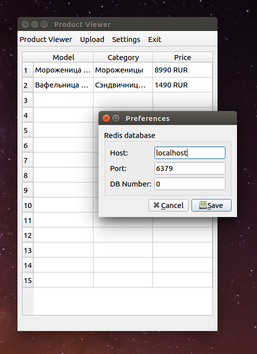

# YML Product Viewer

> A GUI app made with [PyQt5](https://pypi.org/project/PyQt5/)
for viewing offers listed in a specially formatted xml
[yandex yml](https://yandex.com/support/partnermarket/yml/about-yml.html).
Xml file parsed, stored in [Redis](https://github.com/antirez/redis) backend
and then displayed in GUI app.

## Table of Contents

- [Features](#features)
- [Getting Started](#getting-started)
- [Project Structure](#project-structure)
- [List of Packages](#list-of-packages)
- [Useful Resources](#useful-resources)
- [Changelog](#changelog)

## Features

* View offers from yml files in desktop app
* Store and upload cleaned data from yml in database
* Change connection to Redis database

## Getting Started

> Not tested with python 2.7

1. Create virtual environment with (virtualenv, pipenv, direnv, pycharm e.tc)
2. Activate environment and install requirements via `requirements.txt`
3. Run app with `python product_viewer/app.py`

## Project Structure

| Name | Description |
| --- | --- |
| app | Root module, contains toolbar, table and a main window |
| settings | All settings facilities: action, dialog box and a form |
| actions | Stores misc actions - exit and upload new YML file |
| loader | Responsible for parsing YML |
| store | Responsible for loading and storing cleaned data |

## List of Packages

| Package | Description |
| --- | --- |
| PyQt5 | Python bindings to Qt5 library |
| lxml | For xml parsing |
| redis-py | For database access |

## Useful Resources

* Qt documentation [doc.qt.io](https://doc.qt.io)
* Inspiring repository [15 minute PyQt apps](https://github.com/mfitzp/15-minute-apps)
* Book of the same author [Create Simple GUI Applications](https://martinfitzpatrick.name/create-simple-gui-applications)

## Changelog

* **v0.1** (2018-09-20): Initial project structure

:top: [**back to top**](#table-of-contents)
